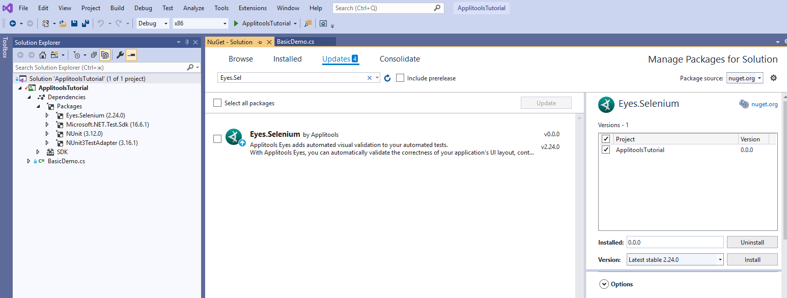

# Pre-requisites:

1. Visual Studio installed on your machine. Workload ".NET desktop development" should be installed in Visual Studio too (if no - add it with Visual Studio Installer)
   * [Install it from here](https://visualstudio.microsoft.com/downloads/)
2. Chrome Webdriver is on your machine and is in the PATH. Here are some resources from the internet that'll help you.
   * https://splinter.readthedocs.io/en/0.1/setup-chrome.html
   * https://stackoverflow.com/questions/38081021/using-selenium-on-mac-chrome
   * https://www.youtube.com/watch?time_continue=182&v=dz59GsdvUF8

# Steps to run this example

1. Git clone this repo
    * `git clone https://github.com/applitools/tutorial-selenium-csharp-basic.git`
2. Open the folder `tutorial-selenium-csharp-basic`
3. Get your API key to set it in code (or in the APPLITOOLS_API_KEY environment variable).
    * You can get your API key by logging into Applitools > Person Icon > My API Key.
4. Double click the `ApplitoolsTutorial.sln`. This will open the project in Visual Studio.
5. Change the `APPLITOOLS_API_KEY` with your own in code.
    Set your ApiKey in string 'config.SetApiKey("...")' (or comment the string and set APPLITOOLS_API_KEY environment variable)
6. Build the project. It can take several minutes.
7. Navigate to Test Explorer (Test > Test Explorer), select test BasicTest and hit Run
8. If needed, in case of some problems - update package Eyes.Selenium by NuGet Package Manager -  Tools > NuGet Package Manager > Manage Nuget Packages for Solution, tab Updates. Select package for update (Eyes.Selenium), select needed version in right panel and tap Install
9. 
